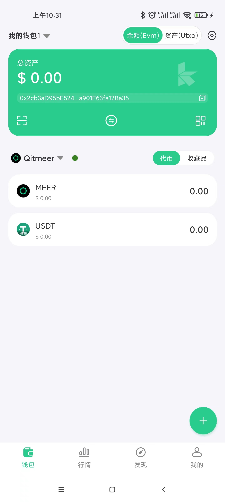

## qx user guide
qx是一个命令行工具，它是bx命令的超集，为密钥管理和事务构造提供了各种命令。

## Prerequisites

Update Go to version at least 1.12 (required >= **1.12**)

Check your golang version

```bash
~ go version
go version go1.12 darwin/amd64
```

## How to build

```bash
~ mkdir -p /tmp/work
~ cd /tmp/work
~ git clone https://github.com/Qitmeer/qx.git
~ cd qx
~ go build
~ ./qx --version
Qx Version : "0.0.1"
```

## qx Commands

```bash
~ qx

Usage: qx [--version] [--help] <command> [<args>]

encode and decode :
    base58-encode         encode a base16 string to a base58 string
    base58-decode         decode a base58 string to a base16 string
    base58check-encode    encode a base58check string
    base58check-decode    decode a base58check string
    base64-encode         encode a base16 string to a base64 string
    base64-encode         encode a base64 string to a base16 string
    rlp-encode            encode a string to a rlp encoded base16 string
    rlp-decode            decode a rlp base16 string to a human-readble representation

hash :
    blake2b256            calculate Blake2b 256 hash of a base16 data.
    blake2b512            calculate Blake2b 512 hash of a base16 data.
    sha256                calculate SHA256 hash of a base16 data.
    sha3-256              calculate SHA3 256 hash of a base16 data.
    keccak-256            calculate legacy keccak 256 hash of a bash16 data.
    blake256              calculate blake256 hash of a base16 data.
    ripemd160             calculate ripemd160 hash of a base16 data.
    bitcion160            calculate ripemd160(sha256(data))
    hash160               calculate ripemd160(blake2b256(data))

entropy (seed) & mnemoic & hd & ec
    entropy               generate a cryptographically secure pseudorandom entropy (seed)
    hd-new                create a new HD(BIP32) private key from an entropy (seed)
    hd-to-ec              convert the HD (BIP32) format private/public key to a EC private/public key
    hd-to-public          derive the HD (BIP32) public key from a HD private key
    hd-decode             decode a HD (BIP32) private/public key serialization format
    hd-derive             Derive a child HD (BIP32) key from another HD public or private key.
    mnemonic-new          create a mnemonic world-list (BIP39) from an entropy
    mnemonic-to-entropy   return back to the entropy (the random seed) from a mnemonic world list (BIP39)
    mnemonic-to-seed      convert a mnemonic world-list (BIP39) to its 512 bits seed 
    ec-new                create a new EC private key from an entropy (seed).
    ec-to-public          derive the EC public key from an EC private key (the compressed format by default )
    ec-to-wif             convert an EC private key to a WIF, associates with the compressed public key by default.
    wif-to-ec             convert a WIF private key to an EC private key.
    wif-to-public         derive the EC public key from a WIF private key.

addr & tx & sign
    ec-to-addr            convert an EC public key to a paymant address. default is nox address
    tx-encode             encode a unsigned transaction.
    tx-decode             decode a transaction in base16 to json format.
    tx-sign               sign a transactions using a private key.
    msg-sign              create a message signature
    msg-verify            validate a message signature
    signature-decode      decode a ECDSA signature

```

## Encoding Commands

Encode/Decocde Qitmeer address & private/pubkey

#### base58-encode

- encode a base16 string to a base58 string

##### Example

```bash
~ qx base58-decode RmCYoUMqKZopUkai2YhUFHR9UeqjeyjTAgW
```

```bash
# base16 string
0df144d959afb6db4ad730a6e2c0daf46ceeb98c53a059cd6527
```

---

#### base58-decode

- decode a base58 string to a base16 string

##### Example

```bash
~ qx base58-decode 1234567890abcdef
```

```bash
# base58 string
43c9JGZmRvE
```

---

#### base58check-encode

- base16 string into Qitmeer or BTC address.

```bash
~ qx base58check-encode
Usage: qx base58check-encode [-v <ver>] [hexstring]
  -a string
    base58check hasher
  -c int
    base58check checksum size (default 4)
  -v version
    base58check version [mainnet|testnet|privnet|btcmainnet|btctestnet|btcregressionnet] (default privnet)
```

##### Example

```bash
# create qitmeer privnet address by base16
~ qx base58check-encode c1c3092d17c917c2799c041aeaeac18822772149

# base58 string
RmPwHCuC2m6gvz9TnVLapHySk1ZU72FTSru
```

```bash
# create btc testnet address by base16
~ qx base58check-encode -v btctestnet c1c3092d17c917c2799c041aeaeac18822772149

# base58 string
myBUMQTmZGK8yKLDranjSQEHbCYCaaywQD
```


##### Qx Generate address by mnemonic

```bash
# create qitmeer mainnet address by mnemonic
~ echo "dune school cash fancy post theory sense again earth divide balcony always"|qx mnemonic-to-seed | qx ec-new |qx ec-to-public|qx ec-to-addr

# qng address
MmVipyQydGr6xN3qNkwBS48fzENUAYmnTZh
```

##### KAHF Generate qng address by mnemonic

```bash
# import new wallet with mnemonic
~ dune school cash fancy post theory sense again earth divide balcony always
```


##### Qx Generate evm bip44 address by mnemonic

```bash
# create qitmeer mainnet address by mnemonic
~ echo "dune school cash fancy post theory sense again earth divide balcony always"|qx mnemonic-to-seed|qx hd-new -v bip32|qx hd-derive -v bip32 -p "m/44'/60'/0'/0/0"|qx hd-to-ec -v bip32|qx ec-to-public|qx ec-to-ethaddr

# qng evm | eth | bsc address
0x2cb3aD95bE524F9d34E17Da37a901F63fa12Ba35
```

##### KAHF Generate evm bip44 address by mnemonic

```bash
# import new wallet with mnemonic
~ dune school cash fancy post theory sense again earth divide balcony always
```




### TxTypeCrossChainImport  (TX from EVM to MEER)
From EVM to MEER PKAddress ```XkCfdHoHHe2raZwNoY4sKcXFf6Jy9Q8XotAHenYsucPrEoj1FeUTR``` 100 MEER coinID : 0 MEER
```bash
$ ./qx tx-encode -v 1 -i 0000000000000000000000000000000000000000000000000000000000000000:4294967294:258:TxTypeCrossChainImport -l 0 -o Tk6uJDaurxqPrg2bZqBa9XSpUcakebZ6EU1u9qqHNDcNW2MyeTtbX:10:0:TxTypeCrossChainImport
```
```output
01000000010000000000000000000000000000000000000000000000000000000000000000feffffff0201000001000000e40b54020000001976a914ada117669b04771e481cc68ae8d4f33f913d1eda88ac0000000000000000cba5c3620100-7b22696e707574223a7b2230223a3235387d2c226f7574707574223a7b2230223a3235387d7d
```
```bash
./qx tx-decode 01000000010000000000000000000000000000000000000000000000000000000000000000feffffff0201000001000000ca9a3b000000001976a914ada117669b04771e481cc68ae8d4f33f913d1eda88ac0000000000000000889b4d630100-7b22696e707574223a7b2230223a3235387d2c226f7574707574223a7b2230223a3235387d7d
```
```json
{
	"txid": "a827b5b2017ccb0a805fcf3c3a0ea89989ae7c86a5019b7673e12f1a1f730e70",
	"txhash": "178c38b90566a6e89db52a73224a4c27f7854b85e63ff7ce5d3b62d538095545",
	"version": 1,
	"locktime": 0,
	"expire": 0,
	"vin": [{
		"type": "TxTypeCrossChainImport",
		"scriptSig": null
	}],
	"vout": [{
		"coin": "MEER",
		"amount": 10000000000,
		"scriptPubKey": {
			"asm": "OP_DUP OP_HASH160 ada117669b04771e481cc68ae8d4f33f913d1eda OP_EQUALVERIFY OP_CHECKSIG",
			"hex": "76a914ada117669b04771e481cc68ae8d4f33f913d1eda88ac",
			"reqSigs": 1,
			"type": "pubkeyhash",
			"addresses": ["MmbRPt1wRcHz1mAiH8Ri1ANtGRyY5ygJ3hJ"]
		}
	}]
}
```
```bash
$ ./qx sign -k (privateKey) -n mixnet 01000000010000000000000000000000000000000000000000000000000000000000000000feffffff0201000001000000e40b54020000001976a914ada117669b04771e481cc68ae8d4f33f913d1eda88ac0000000000000000cba5c3620100-7b22696e707574223a7b2230223a3235387d2c226f7574707574223a7b2230223a3235387d7d
```
```output
01000000010000000000000000000000000000000000000000000000000000000000000000feffffff0201000001000000e40b54020000001976a914ada117669b04771e481cc68ae8d4f33f913d1eda88ac0000000000000000cba5c3620180354d6b42384655315135444761556e7753733679446a36364a7747654550394b4c5461786b626d5351684e396e546d70336566356a6b49483045022100ec14a41b314afc8c4348bab9122176f8d6b4ccbcaf4be1d2dc9be539cf89d98202203eb78a38c0403a8a8bcb63a30f4f39e1bd05031f55bd4c31a902567a5d6f155601
```